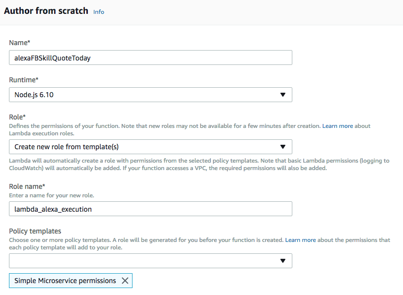

# Build An Alexa Flash Briefing Skill
[](./1-voice-user-interface.md)[](./2-lambda-function.md)[](./3-connect-vui-to-code.md)[](./4-testing.md)[](./5-customization.md)[](./6-publication.md)


## Setting Up A Lambda Function For A Flash Briefing Skill Using Amazon Web Services

In the [first step of this guide](../instructions/1-voice-user-interface.md), we created our Alexa skill.  On this page, we will be creating an AWS Lambda function and then exposing that through API Gateway using [Amazon Web Services](http://aws.amazon.com).  You can read more about [what a Lambda function is](http://aws.amazon.com/lambda), but for the purposes of this guide, what you need to know is that AWS Lambda is where our code lives and that API Gateway allows our skill to connect to the code. When a user asks Alexa for a flash briefing, our skill will access AWS Lambda function via the API Gateway, and provides the conversation back to the user.

1.  Go to **http://aws.amazon.com** and sign in to the console. [If you don't have an AWS account, check out this quick walkthrough for setting it up](https://github.com/alexa/alexa-cookbook/tree/master/aws/set-up-aws.md).

  <a href="https://console.aws.amazon.com/console/home" target="_new"></a>

2.  Click **Services** at the top of the screen and type **Lambda** in the search box.  Lambda can also be found in the list of services in the **Compute** section.

  <a href="https://console.aws.amazon.com/lambda/home" target="_new"></a>

3.  Check your **AWS region.**  Choose the region closest to your customers.

  

4.  Click the **Create function** button. It should be near the top of your screen.  (If you don't see this button, it is because you haven't created a Lambda function before.  Click the blue **Get Started** button near the center of your screen.)

    <a href="#"></a>

5.  There are two boxes labeled "Author from scratch" and "Blueprints". Leave the radio button in the box titled **Author from scratch**.

6.  **Configure your function.** These values will only ever be visible to you, but name your function something meaningful. This sample skill expects the function name to be **alexaFBSkillQuoteToday**. You can choose another name but you will have to adjust the configuration and code accordingly.

7.  Set up your Lambda function's **Role**. These are the AWS Identity and Access Management (IAM) permissions that allow the function to access other parts of AWS.
  * Select **Create new role from template(s)**.
  * Give it a suitable name, such as **lambda_alexa_execution**.
  * Choose a **Policy template** of **Simple Microservice permissions**.
  * For more information there is a [detailed walkthrough for setting up your first role for Lambda](https://github.com/alexa/alexa-cookbook/tree/master/aws/lambda-role.md).

    

8. Click **Create Function** in the bottom right corner.  Scroll down to find it.

    <a href="#"></a>

9.  Upload the sample code.
  * Under **code entry type** select **Upload a .ZIP file**.
  * **Upload** the zip file **lambda/index.zip**.
  * Click **Save**.
  * Under **code entry type** select **Edit code inline**. You should see our code.

11.  Lambda needs to be provided with all the code and libraries that might be called. We uploaded a zip file with the node_modules that our skill uses (alexa-sdk and xml2js). If you want to create a very simple Alexa Skill, you could use **blueprints** and the **alexa-skill-kit-sdk-factskill**. This creates a Lambda function with the alexa-sdk preloaded.
If you create your own zip file package then be careful to have everything in the root of the zip and not the custom folder.

	UPLOAD YOUR CODE.
	YOU WILL CUSTOMIZE THIS IN AN UPCOMING STEP, AND UPDATE THE LAMBDA FUNCTION THEN.

10.	  Alexa expects a response from backend processing within 8 seconds, so after receiving and sending the messages we will be left with around 7 seconds. Remember to keep response times short-and-snappy when designing Skills. If your skill becomes popular you may need to think about how to access data from very large database tables, cope with timeouts when calling external services, cache data, and many other things. Lambda itself is architected to scale well. Scroll down and in the **Basic Settings** increase the timeout to **7** seconds.

12. Configure your trigger. In the **Add triggers** column on the left select **Alexa Skills Kit**.  If you do not see Alexa Skills Kit in the list, jump back to step 3 on this page.

    

    **Scroll down** and click the **Add** button (it is easy to miss this button as it is off the bottom of the screen). Then click the **Save** button in the top right. You should see a green success message at the top of your screen.

    Click the box with the **Lambda icon followed by the name of your function** (alexaFBSkillQuoteToday if you used our suggestion) and scroll down to the field called **Function code**.

13. Send a test message to the new function.

    Near the top-right of the screen, by the Test and Save buttons, select **Configure test events** in the dropdown.

    We are creating a **new test event**, so select **Alexa Start Session** and give it a name like **AlexaStart*.

    Update the 2 occurances of the app id with your actual app id retrieved for the environment variable in the previous step.

    something like changing:
    ```json
    "applicationId": "amzn1.ask.skill.[unique-value-here]"
    ```
    to
    ```json
    "applicationId": "amzn1.ask.skill.3e6f9e91-987c-48b5-123d-45fbe191fdf3"
    ```

    Press the **Test** button. This is testing the Lambda function standalone and will tell us straight away whether things are working or not.

    <br/><br/>
    <a href="./3-connect-vui-to-code.md"></a>
